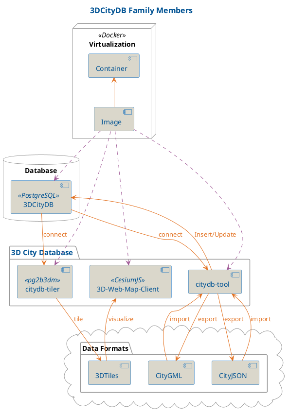

# Infrastructure of the citydb Tools

```puml
@startuml

skinparam component {
  FontSize 14
  FontColor #005293
  BorderColor #0065bd
  BackgroundColor #dad7cb
  ArrowColor #e37222
  ArrowColor<<virt>> #9f5795
  ArrowFontColor #e37222
}

skinparam package {
  FontSize 15
  FontColor #005293
  BorderColor #999999
}

skinparam title {
  FontSize 16
  FontColor #005293
}

title 3DCityDB Family Members

database "Database" {
  [3DCityDB] <<PostgreSQL>>
}

node "Virtualization" <<Docker>> {
  [Container]
  [Image]
}

[Image] -up-> [Container]


package "3D City Database " {
  [citydb-tiler] <<pg2b3dm>> 
  [3D-Web-Map-Client] <<CesiumJS>>
  [citydb-tool]
}

cloud {
  folder "Data Formats" {
    [CityGML]
    [CityJSON]
    [3DTiles]
  }

[3DCityDB] --> [citydb-tool] : connect
[citydb-tool] --> [CityGML] : export
[citydb-tool] --> [CityJSON] : export

[citydb-tool] <-- [CityGML] : import
[citydb-tool] <-- [CityJSON] : import
[citydb-tool] --> [3DCityDB] : Insert/Update

[3DCityDB] --> [citydb-tiler] : connect
[citydb-tiler]  --> [3DTiles] : tile
[3DTiles] -up-> [3D-Web-Map-Client] : visualize

[Image] ..> [3D-Web-Map-Client] <<virt>>
[Image] ..> [citydb-tool] <<virt>>
[Image] ..> [3DCityDB] <<virt>>
[Image] ..> [citydb-tiler] <<virt>>

}
@enduml
```