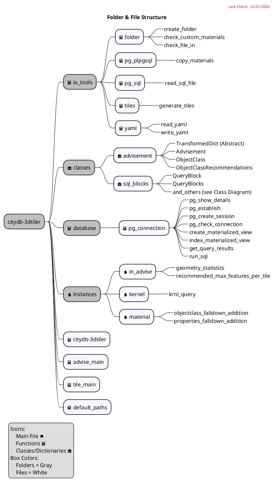

# Folders & Files & Classes / Functions

Following diagram shows which functions/classes are stored in which files & folder.

```puml
@startmindmap
title Folder & File Structure
right header
<font color=red size=10> Last Check : 22.01.2026</font>
endheader
*[#silver] citydb-3dtiler
**[#silver] <&calculator> io_tools
***[#ghostwhite] <&calculator> folder
****_ create_folder
****_ check_custom_materials
****_ check_file_in
***[#ghostwhite] <&calculator> pg_plpgsql
****_ copy_materials
***[#ghostwhite] <&calculator> pg_sql
****_ read_sql_file
***[#ghostwhite] <&calculator> tiles
****_ generate_tiles
***[#ghostwhite] <&calculator> yaml
****_ read_yaml
****_ write_yaml
**[#silver] <&briefcase> classes
***[#ghostwhite] <&briefcase> advisement
****_ TransformedDict (Abstract)
****_ Advisement
****_ ObjectClass
****_ ObjectClassRecommendations
***[#ghostwhite] <&briefcase> sql_blocks
****_ QueryBlock
****_ QueryBlocks
****_ and_others (see Class Diagram)
**[#silver] <&calculator> database
***[#ghostwhite] <&calculator> pg_connection
****_ pg_show_details
****_ pg_establish
****_ pg_create_session
****_ pg_check_connection
****_ create_materialized_view
****_ index_materialized_view
****_ get_query_results
****_ run_sql
**[#silver] <&droplet> instances
***[#ghostwhite] <&droplet> in_advise
****_ geometry_statistics
****_ recommended_max_features_per_tile
***[#ghostwhite] <&droplet> kernel
****_ krnl_query
***[#ghostwhite] <&droplet> material
****_ objectclass_falldown_addition
****_ properties_falldown_addition
**[#ghostwhite] <&calculator> citydb-3dtiler
**[#ghostwhite] <&calculator> advise_main
**[#ghostwhite] <&calculator> tile_main
**[#ghostwhite] <&calculator> default_paths
legend left
    Icons:
        Main File <&home>
        Functions <&calculator>
        Classes/Dictionaries <&briefcase>
    Box Colors:
        Folders = Gray
        Files = White
endlegend
@endmindmap
```
