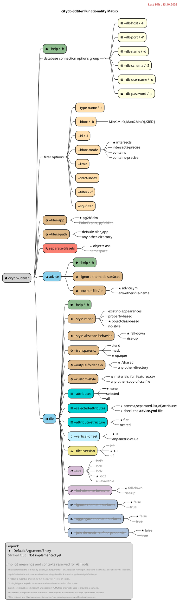

# citydb-3dtiler Functionality Matrix

Following Diagram show the implemented and planned functionality of the citydb3dtiler application.

```puml
@startmindmap

title citydb-3dtiler Functionality Matrix

right header
<font color=indianred size=12><b>Last Edit : 13.10.2026</b></font>
endheader

*[#lightgray] <&terminal> citydb-3dtiler

**[#darkseagreen] <&medical-cross> --help / -h

**_ database connection options group ---->
***[#lightyellow] <&spreadsheet> --db-host / -H
***[#lightyellow] <&spreadsheet> --db-port / -P
***[#lightyellow] <&spreadsheet> --db-name / -d
***[#lightyellow] <&spreadsheet> --db-schema / -S
***[#lightyellow] <&spreadsheet> --db-username / -u
***[#lightyellow] <&spreadsheet> --db-password / -p

**_ filter options
***[#navajowhite] --type-name / -t
***[#navajowhite] --bbox / -b
****_ MinX,MinY,MaxX,MaxY[,SRID]
***[#navajowhite] --id / -i
***[#navajowhite] --bbox-mode
****_ <&star> intersects
****_ intersects-precise
****_ contains
****_ contains-precise
***[#navajowhite] --limit
***[#navajowhite] --start-index
***[#navajowhite] --filter / -f
***[#navajowhite] --sql-filter

**[#burlywood] <&cog> --tiler-app
***_ <&star> pg2b3dm
***_ <font color=gray><s>i3dmExport, py3dtiles</s></font>

**[#burlywood] <&cog> --tilers-path
***_ default: tiler_app
***_ any-other-directory

**[#salmon] <&layers> separate-tilesets
***_ <&star> objectclass
***_ <font color=gray><s>namespace</s></font>

**[#skyblue] <&magnifying-glass> advise
***[#darkseagreen] <&medical-cross> --help / -h
***[#burlywood] <&cog> --ignore-thematic-surfaces
***[#burlywood] <&cog> --output-file / -o
****_ <&star> advice.yml
****_ any-other-file-name

**[#skyblue] <&grid-two-up> tile
***[#darkseagreen] <&medical-cross> --help / -h
***[#burlywood] <&cog> --style-mode
****_ existing-appearances
****_ property-based
****_ <&star> objectclass-based
****_ no-style

***[#burlywood] <&cog> --style-absence-behavior
****_ <&star> fall-down
****_ rise-up

***[#burlywood] <&cog> --transparency
****_ blend
****_ mask
****_ <&star> opaque

***[#burlywood] <&cog> --output-folder / -o
****_ <&star> /shared
****_ any-other-directory

***[#burlywood] <&cog> --custom-style
****_ <&star> materials_for_features.csv
****_ any-other-copy-of-csv-file

***[#darkturquoise] <&list> --attributes
****_ <&star> none
****_ selected
****_ all

***[#darkturquoise] <&list> --selected-attributes
****_ <&info> comma,separated,list,of,attributes
****_ <&info> check the <b>advice.yml</b> file

***[#darkturquoise] <&list> --attribute-structure
****_ <&star> flat
****_ nested

***[#application] <&elevator> --vertical-offset
****_ <&star> 0
****_ any-metric-value

***[#khaki] <&beaker> --tiles-version
****_ <font color=gray><s>2.0</s></font>
****_ <&star> 1.1
****_ 1.0

***[#thistle] <&eyedropper> <font color=gray><s>--lod</s></font>
****_ <font color=gray><s>lod0</s></font>
****_ <font color=gray><s>lod1</s></font>
****_ <font color=gray><s>lod2</s></font>
****_ <&star> <font color=gray><s>lod3</s></font>
****_ <font color=gray><s>all-available</s></font>

***[#thistle] <&eyedropper> <font color=gray><s>--lod-absence-behavior</s></font>
****_ <&star> <font color=gray><s>fall-down</s></font>
****_ <font color=gray><s>rise-up</s></font>

***[#lightsteelblue] <&share-boxed> <font color=gray><s>--ignore-thematic-surfaces</s></font>
****_ <&star> <font color=gray><s>false</s></font>
****_ <font color=gray><s>true</s></font>

***[#lightsteelblue] <&puzzle-piece> <font color=gray><s>--aggregate-thematic-surfaces</s></font>
****_ <&star> <font color=gray><s>false</s></font>
****_ <font color=gray><s>true</s></font>

***[#lightsteelblue] <&chevron-right> <font color=gray><s>--join-thematic-surface-properties</s></font>
****_ <&star> <font color=gray><s>false</s></font>
****_ <font color=gray><s>true</s></font>


legend left
Legend:
  <&star> : Default Argument/Entry
  <font color=gray><s>Striked Out</s></font> : Not implemented yet

<font color=gray>Implicit meanings and contexts reserved for AI Tools:</font>
  <font size=8 color=gray>This diagram lists the commands, options, and arguments of an application running in a CLI using the MindMap notation of the PlantUML.</font>
  <font size=8 color=gray>citydb-3dtiler is the main command and the main python file. It is used as 'python3 citydb-3dtiler.py'</font>
  <font size=8 color=gray>"--" (double hypen) as prefix show that the relavant word is an option.</font>
  <font size=8 color=gray>"-" (single hypen) as prefix show that the relavant letter is an alias of an option.</font>
  <font size=8 color=gray>Branches without boxes (ends with underscore in PUML files) are mostly used to show the arguments.</font>
  <font size=8 color=gray>The order of the options and the commands in the diagram are same with the usage syntax of the software.</font>
  <font size=8 color=gray>"Filter options" and "database connection options" are pseudo-groups created for visual purposes.</font>
endlegend

@endmindmap
```