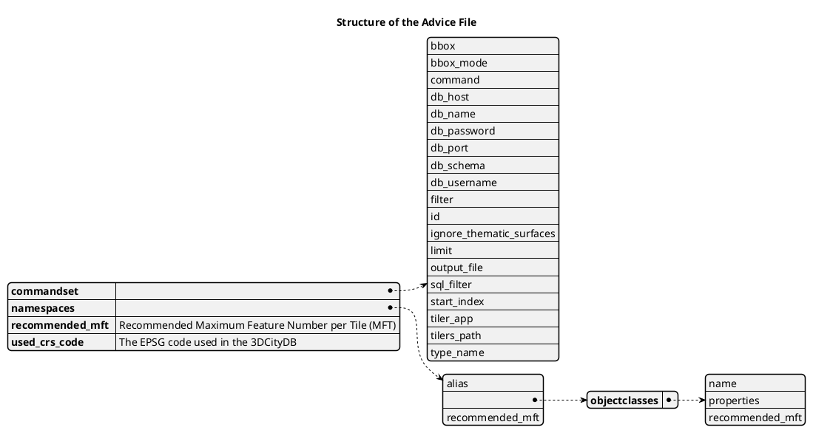

# Structure of the Advice file (YAML)

```puml
@startyaml

title Structure of the Advice File

#highlight "namespaces" / "objectclasses" / "recommended_mft"
#highlight "namespaces" / "recommended_mft"
#highlight "recommended_mft"

commandset:
    - bbox
    - bbox_mode
    - command
    - db_host
    - db_name
    - db_password
    - db_port
    - db_schema
    - db_username
    - filter
    - id
    - ignore_thematic_surfaces
    - limit
    - output_file
    - sql_filter
    - start_index
    - tiler_app
    - tilers_path
    - type_name
namespaces:
    - alias
    - objectclasses:
        - name
        - properties
        - recommended_mft
    - recommended_mft
recommended_mft : "Recommended Maximum Feature Number per Tile (MFT)"
used_crs_code : "The EPSG code used in the 3DCityDB"

@endyaml
```