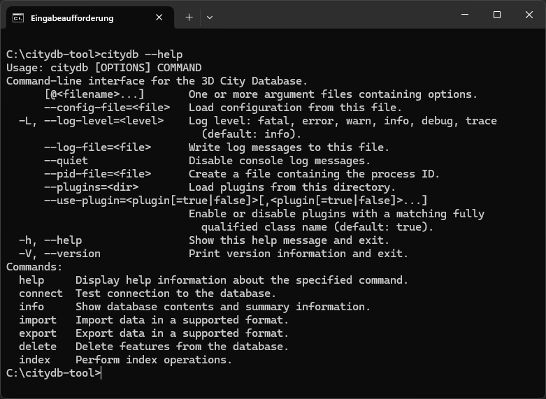

`citydb-tool` is the default command-line client for the 3D City Database `v5`. It supports importing and exporting city
model data, as well as data and database management operations. The command-line interface (CLI) offers various
commands for interacting with the database, each with its own parameters and options. In addition to manual execution
in a shell, `citydb-tool` can be automated, integrated with other software, and used in workflows and pipelines.

## Key features

- Support for CityGML 3.0, 2.0, and 1.0
- Support for CityJSON 2.0, 1.1, and 1.0, including CityJSONSeq
- On-the-fly upgrade and downgrade between versions
- Import and export of datasets of any file size
- Multiple import strategies for consistent city model updates
- Deletion and termination of city objects with support for object histories
- Advanced querying capabilities based on [OGC CQL2](https://www.ogc.org/publications/standard/cql2/){target="blank"} and SQL
- Extensible via user-defined plugins
- Easy deployment and execution in a Docker container
- Seamless integration into automation workflows for streamlined processes

!!! tip
    `citydb-tool` is more than a CLI. It also provides an easy-to-use Java API, making it simple to integrate 3DCityDB support
    into your own Java applications.

## Installing and launching

To obtain citydb-tool, follow the [download instructions](../download.md#citydb-tool-database-client). Java is required
to run the software. For more information, consult the [system requirements](../first-steps/requirements.md#citydb-tool-database-client).

citydb-tool is distributed as a ZIP package and does not require installation. Simply extract the package to a
directory of your choice. Inside this directory, you will find the `citydb` start script for running the tool.
Two versions of this start script are provided:

1. `citydb` for UNIX/Linux/macOS systems; and
2. `citydb.bat` for Windows systems.

To launch citydb-tool, open a shell, navigate to the citydb-tool installation directory, and run the following command
to display a general help message in the console. On UNIX/Linux systems, you may first need to adjust file permissions
to make the script executable.

=== "Linux"

    ```bash
    chmod u+x citydb
    ./citydb --help
    ```

=== "Windows CMD"

    ```shell
    citydb --help    # you can omit the .bat file extension
    ```

If your system is set up correctly and the `citydb --help` command runs successfully, you should see output similar to the
example below.


/// figure-caption
Running `citydb --help` in the Windows Command Prompt.
///

## Using environment variables for launch

citydb-tool supports the following environment variables to configure the launch process.

| Environment variable | Description                                                                                                                 |
|----------------------|-----------------------------------------------------------------------------------------------------------------------------|
| `JAVA_HOME`          | Specifies the directory where the Java Runtime Environment (JRE) or Java Development Kit (JDK) is installed on your system. |
| `DEFAULT_JVM_OPTS`   | Defines Java Virtual Machine (JVM) options for the launch process.                                                          |
| `JAVA_OPTS`          | Functions like `DEFAULT_JVM_OPTS`, but takes precedence over it.                                                            |
| `CITYDB_OPTS`        | Functions like `JAVA_OPTS` and `DEFAULT_JVM_OPTS`, but takes precedence over both.                                          |

`JAVA_HOME` defines the JRE or JDK that citydb-tool will use. This is helpful if you want to use a different
version of Java than the system default or if the Java installation is not automatically detected, preventing
citydb-tool from launching.

citydb-tool is launched with default JVM options, which can be overridden by setting the `CITYDB_OPTS`
environment variable. You can also use `JAVA_OPTS` or `DEFAULT_JVM_OPTS` to pass JVM options to the `citydb`
script. For example, to increase the JVM's maximum heap size, the option `-Xmx` can be used. The following command
shows how to set `JAVA_HOME` to specify the Java installation and use `CITYDB_OPTS` to allocate 2 gigabytes for
the heap space.

=== "Linux"

    ```bash
    export JAVA_HOME="/path/to/your/java/installation"
    export CITYDB_OPTS="-Xmx2g"

    ./citydb import citygml \
        -H localhost -d citydb -u citydb_user -p mySecret \
        /my/city.gml
    ```

=== "Windows CMD"

    ```bat
    set JAVA_HOME="C:\path\to\your\java\installation"
    set CITYDB_OPTS="-Xmx2g"

    citydb import citygml citygml ^
        -H localhost -d citydb -u citydb_user -p mySecret ^
        C:\my\city.gml
    ```

Additional JVM options, such as `-Xms` for the initial heap size or `-Dproperty=value` for system properties, can also be
added as needed.

!!! tip
    The default JVM options are typically sufficient for most use cases and should only be overridden if necessary.
    Advanced users can also modify the `citydb` start script directly to adjust the launch configuration and add custom
    JVM options.
