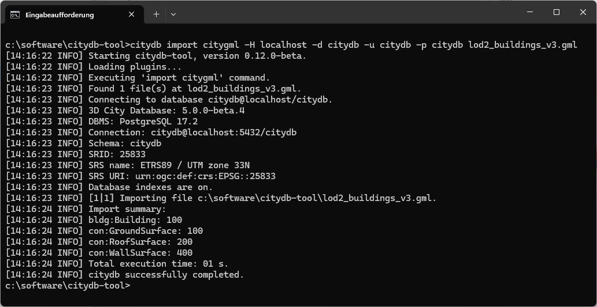
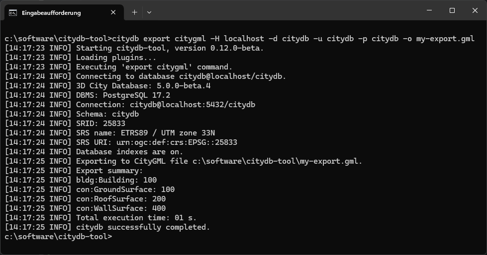

This guide provides a quick introduction to importing and exporting CityGML or CityJSON data into the 3DCityDB
using `citydb-tool`. It is intended to help you get started with the basics, while the full documentation
of citydb-tool is available [here](../citydb-tool/index.md). citydb-tool is the default command-line client for
3DCityDB v5, designed for importing and exporting city model data and performing various database operations.

## Prerequisites

Before you begin, ensure you have the following:

- A ready-to-use 3DCityDB `v5` instance (see [3DCitydb setup guide](setup.md)).
- A matching release package of `citydb-tool` (follow the [download instructions](../download.md)).
- A system that meets the [requirements](requirements.md#citydb-tool-database-client) for running citydb-tool.
- A CityGML dataset to import.

## Step 1: Setting up citydb-tool

citydb-tool is distributed as a ZIP package and does not require a specific installation process. Simply extract the
package to a directory of your choice. Inside this directory, you will find the `citydb` start script for running
the tool. Two versions of this start script are provided:

1. `citydb` for UNIX/Linux/macOS systems; and
2. `citydb.bat` for Windows systems.

citydb-tool is a **command-line tool** that offers multiple commands, each with its own set of command-line parameters
and options, making it best run from within a shell environment. To quickly verify that the tool is working
correctly on your system, open a shell, navigate to the installation directory of citydb-tool, and run the
following command to print its version information to the console. On UNIX/Linux machines, you may first need to
set the appropriate file permissions to make the script executable.

=== "Linux"

    ```bash
    chmod u+x citydb
    ./citydb --version
    ```

=== "Windows CMD"

    ```shell
    citydb --version    # you can omit the .bat file extension
    ```

`citydb --help` lists all available commands in citydb-tool. Note that some commands may have subcommands.
To display help information for a specific (sub)command, simply use `citydb COMMAND [SUBCOMMAND...] --help`.

## Step 2: Importing CityGML data

Once you have confirmed that citydb-tool is working correctly, you can proceed with importing CityGML data into
your 3DCityDB instance. For this, ensure that you have the database connection details ready or consult your
database administrator.

!!! tip
    If you do not have a CityGML dataset available for this step, you can use one of the sample
    datasets provided by citydb-tool in the `samples/datasets` subfolder.

The general command to import CityGML data is shown below:

=== "Linux"

    ```bash
    ./citydb import citygml \
        -H the.host.de \
        -d theDBName \
        -u theUsername \
        -p theSecretPass \
        /path/to/citygml.gml
    ```

=== "Windows CMD"

    ```bat
    citydb import citygml ^
        -H the.host.de ^
        -d theDBName ^
        -u theUsername ^
        -p theSecretPass ^
        C:\path\to\citygml.gml
    ```

The parameters used in this simple example are:

- `-H`: The host of your 3DCityDB instance (e.g., localhost or the.host.de).
- `-d`: The name of the 3DCityDB database where the CityGML data will be imported.
- `-u`: The database username with sufficient privileges to perform the import.
- `-p`: The password for the provided database username (leave empty to be prompted!).
- `/path/to/citygml.gml`: The path to the CityGML file you wish to import.

During the import process, log messages will be printed to the console, informing you about the progress of the
operation. If the import completes successfully, a summary of the imported city objects will be
displayed. In case of errors, the import is aborted, and an error message with details about the cause
will be shown. To enable more verbose logging and get additional error details, add the `--log-level debug`
parameter to the export command.


/// figure-caption
Example console output of a citydb-tool import operation.
///

!!! tip
    To import a CityJSON dataset instead, simply use the command `import cityjson` and point to
    your CityJSON input file.

## Step 3: Exporting CityGML data

Exporting the data from the 3DCityDB back to CityGML format is as easy as this:

=== "Linux"

    ```bash
    ./citydb export citygml \
        -H the.host.de \
        -d theDBName \
        -u theUsername \
        -p theSecretPass \
        -o /path/to/target/citygml.gml
    ```

=== "Windows CMD"

    ```bat
    citydb export citygml ^
        -H the.host.de ^
        -d theDBName ^
        -u theUsername ^
        -p theSecretPass ^
        -o C:\path\to\target\citygml.gml
    ```

The output file's path and name must be specified using the `-o` parameter. All other parameters in this example match
those used in the import operation. The export process logs progress and errors just like the import.
Use `--log-level debug` for detailed output. If you want to export to a different CityGML version, use the
`-v` parameter with `3.0`, `2.0`, or `1.0` as the value, depending on the desired target version.

Once the export completes successfully, a summary of the exported city objects will be shown.


/// figure-caption
Example console output of a citydb-tool export operation.
///

!!! tip
    To export the data in CityJSON format, simply use the command `export cityjson` instead. This works
    even if you have imported a CityGML file, as citydb-tool applies an on-the-fly conversion between both formats.

[](https://hits.seeyoufarm.com/#history)

/// caption
///
