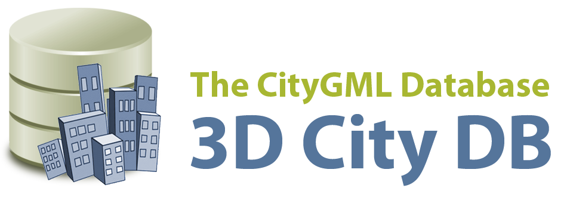

## :simple-rocket: Welcome to the 3D City Database `v5` documentation :simple-rocket:

[{ width="400" }](https://www.3dcitydb.org){target="blank"}
/// caption
///

The 3D City Database (3DCityDB) is a free and open source package consisting of a database schema and a set of software
tools to import, export, manage, analyse, and visualize virtual 3D city models on top of a spatial database system.

!!! info "Documented software versions"
    | | |
    | - | - |
    | 3D City Database: | `5.1` |
    | citydb-tool: | `1.2` |

## Content overview

- :material-clock-fast:{ .lg .middle } __Getting started__

    ---

    3DCityDB and tools setup, get up and running with Docker in minutes

    [:octicons-arrow-right-24: First steps](first-steps/index.md)

- :material-download:{ .lg .middle } __Downloads__

    ---

    Download 3DCityDB and tools

    [:octicons-arrow-right-24: Get the software](download.md)

- :fontawesome-solid-gears:{ .lg .middle } __Compatibility__

    ---

    Compatibility of CityGML versions and 3DCityDB tools, data migration

    [:octicons-arrow-right-24: Compatibility and data migration](compatibility.md)

- :material-database:{ .lg .middle } __3D City Database__

    ---

    3DCityDB's relational schema explained, Docker usage

    [:octicons-arrow-right-24: 3D City Database](3dcitydb/index.md)

- :material-database-edit:{ .lg .middle } __Data management__

    ---

    Connect to a 3DCityDB, import and export data, and run database operations

    [:octicons-arrow-right-24: citydb-tool](citydb-tool/index.md)

- :material-file-search:{ .lg .middle } __About this documentation__

    ---

    How to quickly navigate, search and, contribute to this docs

    [:octicons-arrow-right-24: Usage and contribution](usage-contrib.md)

- :material-heart:{ .lg .middle } __Contributors__

    ---

    Get to know the people, organizations and contributors behind 3DCityDB

    [:octicons-arrow-right-24: Contributors](contributors/index.md)

## Feedback and contributions

The content of this documentation is all new! If you encounter a mistake, miss some content, or for any other input,
please get in touch on [GitHub discussions](https://github.com/orgs/3dcitydb/discussions), or submit an [issue](https://github.com/3dcitydb/3dcitydb-mkdocs/issues)/[pull request](https://github.com/3dcitydb/3dcitydb-mkdocs/pulls).
For things that should not be visible on GitHub you can reach us at <3dcitydb@tum.de>.
We are happy for any feedback or contribution we can use to improve 3DCityDB, its components, and this documentation.

## Legacy documentation

The legacy documentation of the 3D City Database `v4` is available here: <https://3dcitydb-docs.readthedocs.io/>