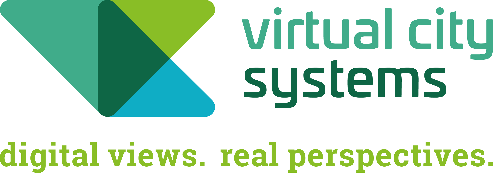
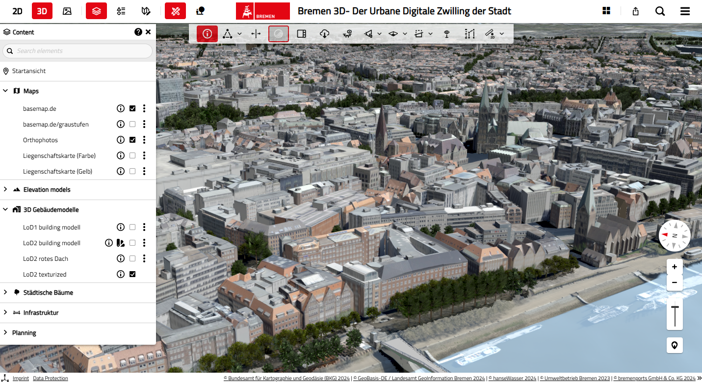

{width="300"}

Since 2005, [Virtual City Systems](https://vc.systems/en/) has been developing software solutions for managing,
distributing, and utilizing digital 3D city models and urban twins. Our technology enables the efficient
processing of geospatial data, supporting cities and municipalities in building holistic digital twins and shaping
the future of urban planning.

By leveraging digital city models, interactive 3D simulations, and the seamless integration of geospatial data into
existing IT and process landscapes, we actively contribute to optimizing urban processes. Our solutions are trusted by
cities of all sizes, from smaller municipalities to major cities such as Hamburg, Vienna, Helsinki, and Singapore.
Through our involvement in research projects, we continuously drive innovation in urban planning, climate adaptation,
and risk analysis.

## 3DCityDB @ VCS – Driving Development and Application

Since 2010, VCS has been a key contributor to the 3D City Database (3DCityDB), a milestone for the CityGML community
and a core component of our products and services. By continuously advancing and widely applying 3DCityDB
and CityGML in customer and research projects, we play a vital role in the global adoption of urban digital twins.
Built on 3DCityDB, our [VC Database](https://vc.systems/en/products/vc-database/) provides a reliable solution for
storing and managing CityGML-based 3D city models, ensuring scalable and efficient management of urban data.

## VC Suite — Ready to Twin

The **VC Suite** is our innovative 3D urban platform solution, designed to build, manage, and leverage 3D city models. It
forms the foundation for creating urban digital twins, transforming complex geospatial data into valuable, actionable
insights. With tools such as [VC Map](https://vc.systems/en/products/vc-map/), [VC Publisher](https://vc.systems/en/products/vc-publisher/),
[VC Warehouse](https://vc.systems/en/products/vc-warehouse/), and [VC Solar](https://vc.systems/en/products/vc-solar/),
the VC Suite empowers smart city applications, simulations, and analyses, enabling our customers to make more
informed decisions and optimize urban planning. 

Rooted in our commitment to open standards, interfaces, and APIs, the VC Suite seamlessly integrates
with other systems, unlocking data from proprietary silos. Beyond 3DCityDB, we actively contribute to the
open-source community. As part of this effort, we have released
[VC Map as open source](https://github.com/virtualcitySYSTEMS/map-ui) — a high-performance, modern
web mapping application that integrates 3D and 2D geospatial data, oblique aerial imagery, panoramic views, sensor data,
and urban designs, delivering an immersive digital twin experience accessible to all on the web.

/// figure-caption
The Urban Digital Twin of the City Of Bremen, managed with 3DCityDB and visualized with VC Map.
///

## Urban Simulations – Data-Driven Planning Certainty

VCS supports simulations for solar potential analysis, flood risk assessment, urban climate studies, and hazard
analysis, such as detecting and neutralizing unexploded ordnance. These models provide critical data and insights on
environmental impacts and risks, helping planners implement early measures for climate adaptation and risk mitigation.
CityGML and 3DCityDB serve as the foundation for these simulations and analyses.

/// figure-caption
Urban climate simulations and what-if scenarios, visualized in VC Map. 
///

## Your contact: Claus Nagel

{ align="right" width="230"}
Dr. Claus Nagel is Managing Director of Virtual City Systems and a leading expert in 3D city models and digital twins.
He has played a key role in the development of CityGML and the 3D City Database, significantly advancing their
worldwide adoption in research, public administration, and industry.

&nbsp;
&nbsp;
&nbsp;
&nbsp;

&nbsp;

/// caption
///